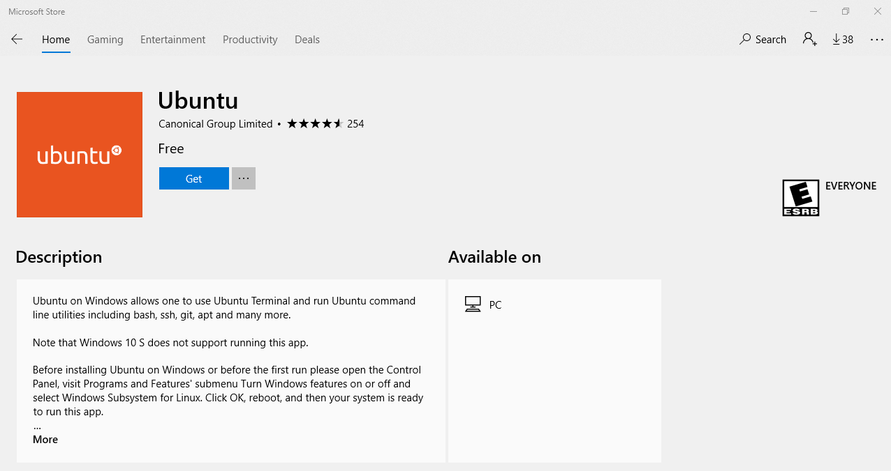
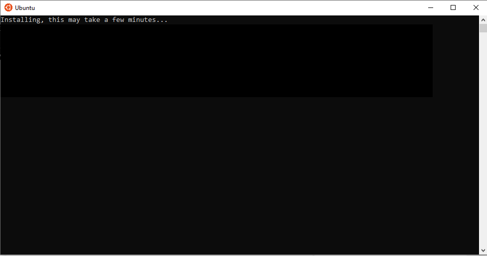
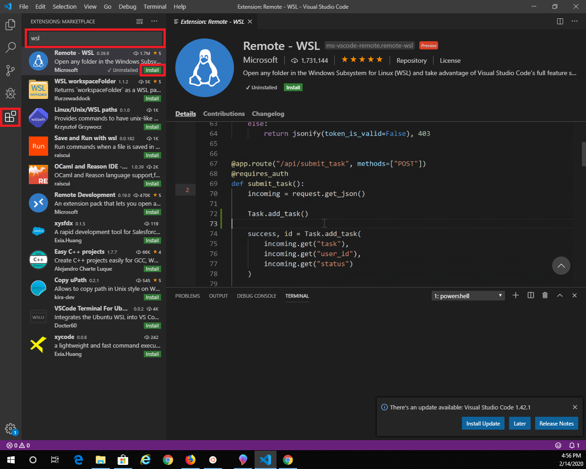
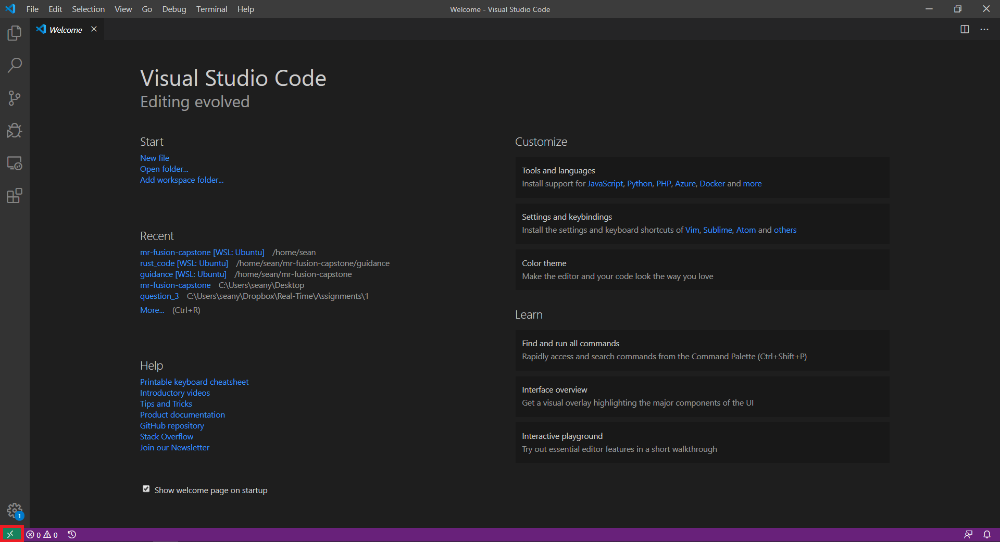

# Mr. Fusion CEC/EE 420 Capstone Project

The Mr. Fusion project aims to build an autonomous robot capable of giving
tours on ERAU campus. The autopilot system is divided into three subsystems:
guidance, navigation, and control (GNC).

## Description

### Guidance

The guidance subsystem is responsible for path planning and decision making
for determining where the robot shall go during operation. It includes a
map of campus for coarse path planning and waypoint generation and uses a
3D time of flight (ToF) camera for environmental perception. Observing its
surroundings allows the robot to avoid static obstacles and stay on traversable
paths.

Subteam members:  
* David Stockhouse
* Sean Link

### Navigation

The navigation subsystem uses a sensor suite to determine precisely localize
the robot's position. The sensor suite contains an IMU, GPS, magnetometer, 
barometer. Additionally, the navigation subsystem uses wheel odometry from the
robot's motor encoders and computes optical flow from ToF images to estimate 
visual odometry. All sensor measurements are fused together for a high fidelity
estimate of the robot's position.

Subteam members:  
* Joseph Kroeker
* Emmett Hamman
* TJ Hall

### Control

The control subsystem drives the robot's motors to influence its position
according to commands generated by the guidance subsystem. The control
subsystem uses a dynamic model of the robot platform to send appropriate
control signals to the motors and correctly drive the robot where needed.

Subteam members:  
* Connor Rockwell
* Joy Fucella
* Duncan Patel

## Environment

For running unit tests the computer should be compliant with the `x86` instruction set architecture and run the ubuntu operating system.

For running the application, the hardware should abide by the ARM-A architecture running ubuntu.

### Setting up your Environment on a Windows Host

The following section is intended to setup your environment so you may develop, compile, and run unit tests on your person machine running Windows.


1. Start by Enabling a feature that allows your windows machine to run linux by running the **Windows Power Shell** as an **Administrator** and entering the following command.

Note: You will be required to restart your system after running this command.

``` powershell
Enable-WindowsOptionalFeature -Online -FeatureName Microsoft-Windows-Subsystem-Linux
```

3. Navigate to the **Microsoft Store**  and download Ubuntu.



4. Install Ubuntu by running the downloaded application. You should get a terminal that looks similar to the following.



5. After the ubuntu installation is completed, download and install our development environment [Visual Studio Code](https://code.visualstudio.com/).
   
6. Launch VSCode and install the **Remote - WSL** extension by following the call outs in the image below. This will allow us to run commands on our ubuntu environment from VSCode. 



A green icon should now be visible in the bottom left of your screen.



7. Press the green button in the bottom left corner and select **Remote-WSL: New Window**. A new instance of VSCode should launch, and be connected to our ubuntu environment.
   
8. In the new VSCode instance, open your terminal using `Ctrl + ~`

9. Clone the Mr. Fusion Repo

```
git clone https://github.com/dstockhouse/mr-fusion-capstone.git
```  

10.  To install dependencies such as make, gcc, and rust, that allow for the code to be built, navigate to the directory that contains the `install_dependencies.sh` file and run it using th following command.

```
sudo ./install_dependencies.sh
```

Note: You will be prompted to specify what type of installations you want. Select default for all of them.

1.  Install dependencies, such as CGreen, for unit tests  by navigating to the directory that contains the `install_dev_dependencies.sh` script and running the following command.

```
sudo ./install_dev_dependencies.sh
```

## Building and Tests

To build the executable for each of the subsystems, enter each subsystem directory and execute `make`. To execute the
test suite, first `make clean` and then run `make test`. Cgreen must be installed to build and run the test suite.

To build the guidance system written in rust, navigate to the `guidance/rust_code` directory and execute the following
command

```
cargo build
```

To run the guidance executable, enter

```
cargo run
```

To build and run the guidance executable with unit tests, enter

```
cargo test -- --test-threads=1
```

### Automated Tests

To see the automated test results, see the following link.

https://travis-ci.com/dstockhouse/mr-fusion-capstone

## Contact

Project Lead - Joseph Kroeker  
[kroekerj@my.erau.edu](mailto:kroekerj@my.erau.edu)

Technical Lead - David Stockhouse  
[stockhod@my.erau.edu](mailto:stockhod@my.erau.edu)

